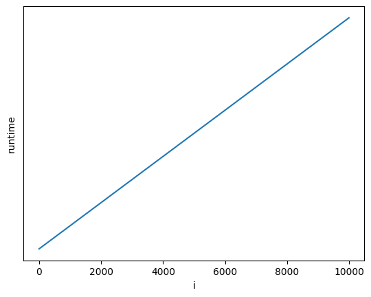

# LHF Blocks World Analysis
## Introduction
There are a few data structures that should be shown before jumping into code analysis.

```Rust
pub type Block = usize;

pub struct Location {
    pub c: usize,   // The index of the column
    pub h: usize,   // The height within the column
}
```

## Analytical Analysis
This program uses redundancy to keep access times low. The original idea was to store an array of `n` vectors, each vector representing a column. But the instructions act directly on blocks, rather than locations, so we need to know where each block is at all times. Therefore, this program uses a `World` struct that holds a lookup table from block number to location (`Index`) as well as the data structure described above (`Geography`), which acts as a lookup table from location to block number. 

```Rust
pub type Geography = [Vec<Block>];
pub type Index = [Location];  // column, height
pub struct World {
    geo: Box<Geography>,
    ind: Box<Index>,
}
```

### Analysis of Functions

The only functions that deal with these fields directly are 
* `World::get_location`, which simply looks up the location of a block in the `Index`,
* `World::return_`, which returns the block from on top of the given column,
* `World::clear`, which returns all blocks on top of the given block,
* `World::move_top_of_column`, which moves the block from the top of one column to the top of another column, and 
* `World::move_block_and_above`, which moves the given block and all on top of it from its current location to the top of another column.

These are the basic, low-level operations used by the program. For example, the instruction, `move a onto b`, can be done by calling `clear` on both `a` and `b` and then calling `move_top_of_column` on `a`'s column and `b`'s column. Remember that a block's column can be found in constant time, because `get_location` just looks up the location in the `Index`.

Of these low-level functions, the lowest level are `move_top_of_column` and `move_block_and_above`, so we will start there.

#### `World::move_top_of_column`
```Rust
/// Moves the block from the top of tower, `from_c` to the top of the tower, `to_c`.
/// 
/// Panics if tower, `from_c` is empty.
/// 
/// Preserves reduncancy consistency.
fn move_top_of_column(&mut self, from_c: usize, to_c: usize) {
    let block: Block = self.geo[from_c].pop().unwrap();
    self.geo[to_c].push(block);
    let new_height = self.geo[to_c].len();
    self.ind[block] = Location { c: to_c, h: new_height - 1 };
}
```
First, this function pops the block from the top of its current tower in the geography and pushes it onto its new tower. That is all that would be requrired if all we had was a geography, but because we want to preserve consistency between the geography and the index, we must also update the location in the `self.ind` to point to this block's new location. 

This function runs in $\Theta(1)$ time.

#### `World::move_block_and_above`
```Rust
fn move_block_and_above(&mut self, Location { c: from_c, h }: Location, to_c: usize) {
    let (to_leave, to_move) = self.geo[from_c].split_at(h);
    let to_leave: Vec<_> = to_leave.into_iter().map(|x| *x).collect();
    let to_move: Vec<_> = to_move.into_iter().map(|x| *x).collect();
    self.geo[from_c] = to_leave;
    for block in to_move {
        self.ind[block] = Location { c: to_c, h: self.geo[to_c].len() };
        self.geo[to_c].push(block);
    }
}
```
This function splits tower `from_c` at `h`, the height of the block we want to move. `split_at` returns two slices, holding elements, `[0, h)` and `[h, len)` respectively. All blocks with a height `< h` we want to leave, and all blocks with a height `>= h` we want to move. Then it pushes all elements in `to_move` in order onto tower `to_c`, while keeping the index consistent with the geography. 

The size of `to_move` is $O(H_c)$, where $H_c$ is the height of column $c$. And since we at least need to loop through all elements in the tower we are moving from (to copy into `to_leave` and `to_move`), this function runs in $\Theta(H_c)$ time. 

#### `World::return_`
This function only involves popping the top element from one column and pushing it onto another, then updating the index with the new column and height, which runs in $\Theta(1)$ time. 

#### `World::clear`
This function simply calls `return_` as many times as it takes to clear all blocks above the given block. It runs in $O(H_c)$ time. 

### Analysis of Instructions
For the sake of simple equations, I will replace $H_c$ with $H$, the height of the tallest tower. This will give us a $O$ assymptotic equation rather than a $\Theta$. 

* Executing a `move onto` instruction involves making two calls to `clear` and one call to `move_top_of_column`. The runtime is $O(H) + O(H) + O(1) = O(H)$.
* Executing a `move over` instruction only involves making one call to `clear` and one call to `move_top_of_column`. The runtime is $O(H) + O(1) = O(H)$.
* Executing a `pile onto` instruction involves making one call to `clear` and one call to `move_block_and_above`. The runtime is $O(H) + O(H) = O(H)$.
* Executing a `pile over` instruction involves making one call to `move_block_and_above`. The runtime is $O(H)$.

Overall, we can execute any instruction in $O(H)$ time. Therefore, we can execute $i$ instructions in $O(iH)$ time. Because some instructions involve returning many blocks to their starting position, I would expect $H$ to be quite small if random instructions are given. 

We can tell if an instruction is illegal quite easily because we can find a block's location in constant time.


*Runtime is proportional to the number of instructions*
