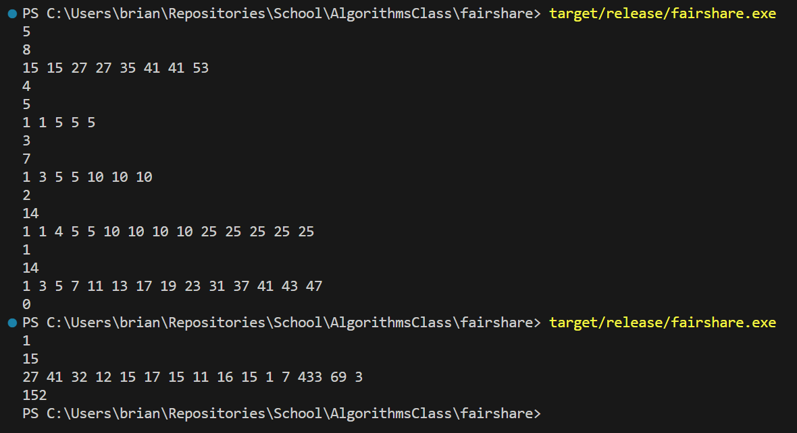

# Fair Share Dynamic Programming Lab
Brian Smith and Enkh-Od Zol-Od

# How it Works (Is it DP?)
This algorithm traverses most of the decision tree, but it saves some time by dividing the problem into two subproblems and combining the result of each of the subproblems. It is not a divide-and-conquer approach, however, because it does not do this recursively. It just divides the problem one time at the beginning. 

There are $2^n$ ways to divide the coins between the two friends, although there are duplicates in that the "way" each coin goes can be flipped (for all coins) without changing the result, so the total number of ways to divide the coins is $2^n/2 = 2^{n-1}$. This algorithm runs in $O(n \cdot 2^{n/2})$ worst case, which is asymptotically less than $2^{n-1}$. 

If we suppose we have $n = 4$ coins, then we have $2^4 = 16$ ways to divide the coins (including duplicate ways). One such division is

$$(c_1, c_2, c_3, c_4) \rightarrow (+, -, +, -)$$

### `fn get_combos(coins: &[usize]) -> Vec<usize>`
The function, `get_combos` builds/traverses the decision tree for the given set of coins (this is important later) and returns the list of leaves, which represent all possible diffs (between one friend and the other).

The decision tree looks like a binary tree of height $n + 1$ and $2^n$ leaves. Each node holds the absolute difference between the sum of the coins given to one friend and the sum of the coins given to the other friend up to that point. We can go from a node to its two children by adding and subtracting the value of the next coin to/from the diff at this node. If the result is negative, then take the absolute value of it. (Rust has a function for finding the absolute difference between two numbers, `abs_diff`. It is necessary when you want the absolute difference between two unsigned numbers, because in debug builds, overflows and underflows crash the program.) 

After we calculate the values for the next row, we can save some performance by reducing the row to its unique values, since two nodes on the same level with the same diff will have the same decision subtrees. This is done in time linear to the number of nodes in the row. But it is not guaranteed that there will be any duplicates. The worst case for this would be if each coin is a different power of 2. (Although, on a 64-bit machine, there are only 64 possible powers of 2, and the problem restricts the coin values to 500 or less anyway, so it is safe to say that some performance will be gained because of this.) It is this memoization of common subproblems that makes this algorithm a Dynamic Programming approach.

### `fn solve_fs(coins: &[usize]) -> usize`
Traversing/building the entire decision tree can therefore be done in $O(2^n)$, but as mentioned, this algorithm--in the function, `solve_fs`--splits the tree into two trees, each with a height of $n/2$ and then traverses each of them by calling `get_combos`. In all, it traverses $2 \cdot 2 ^ {n / 2}$ nodes. We know that each coin will either be given to one person or the other. This is still true if we split the coins into two groups. So,

$$(c_1, c_2, c_3, c_4) \rightarrow ((+, -), (+, -))$$

The decision tree for the left $n/2$ coins will have less or equal to $2^{n/2}$ leaves (call the set of leaves $\Delta_l$), and the tree for the right $n/2$ coins will have less or equal to $2^{n/2}$ leaves (call the set of leaves $\Delta_r$). Again, each leaf corresponds to a unique combination of adding or subtracting all the coins in that group and holds the resultant diff. So, the solution to the Fair Share problem is 

$$\delta = \min_{\delta_l \in \Delta_l, \delta_r \in \Delta_r} |\delta_l - \delta_r|$$

### `fn get_min_dist(left_combos: &[usize], right_combos: &[usize]) -> usize`
Finally, we need to combine the result of `get_combos(left_coins)` with that of `get_combos(right_coins)`. As the above equation says, we do this by finding the pair of diffs--one from the left coins and one from the right coins--that are closest. We could iterate over all such pairs and complete in $O(n^2)$ time, but remember that the size of `left_combos` and `right_combos` is less or equal to $2^{n/2}$, so a quadratic search would become $O(2^n)$. So instead, we combine the two lists, while keeping the origin of each element in memory, and we sort the combined list. Then, we iterate over consecutive pairs in the sorted combined list, and find the min of the absolute differences of the consecutive pairs but only those pairs where one element came from the left and one came from the right. 

The combined list has a size that is less or equal to $2 \cdot 2^{n/2}$, so the sorting algorithm can run in 

$$O(2^{n/2} \cdot lg(2^{n/2})) = O(n \cdot 2^{n/2})$$

The rest of the algorithm ran in $O(2^{n/2})$, so the slowest part is combining the two results, $O(n \cdot 2^{n/2})$, which is still assymptotically less than $2^n$. 

## Proof of Correctness


## Source Code
The Source Code can be found on [GitHub](https://github.com/Budmeister/AlgorithmsClass/tree/main/fairshare).

### `main.rs`
```Rust
mod error;
mod input;
mod fairshare;

use error::Result;
use input::Coins;

fn main() -> Result<()> {
    for coins in input::get_input()? {
        let coins: Coins = coins?;
        let diff = fairshare::solve_fs(&coins);
        println!("{}", diff);
    }
    Ok(())
}
```

### `fairshare.rs`
```Rust
use crate::input::RefCoins;
use std::collections::HashSet;
use std::ops::Deref;
use std::ops::DerefMut;

pub fn solve_fs(coins: RefCoins) -> usize {
    let (left_coins, right_coins) = coins.split_at(coins.len() / 2);
    let left_combos = get_combos(left_coins);
    let right_combos = get_combos(right_coins);

    let diff = get_min_dist(&left_combos, &right_combos);
    match diff {
        Some(diff) => diff,
        None => {
            // left or right must be empty
            let diff = left_combos
                .iter().chain(right_combos.iter())
                .min();
            match diff {
                Some(diff) => *diff,
                None => panic!("Cannot solve fairshare problem on empty coin set"),
            }
        }
    }
}

fn get_combos(coins: RefCoins) -> Vec<usize> {
    let mut combos = vec![0];
    let mut seen = HashSet::new();

    for coin in coins {
        seen.clear();
        combos.extend_from_within(0..combos.len());
        let len = combos.len();
        let (plus, minus) = combos.split_at_mut(len / 2);
        for combo in plus {
            *combo += coin;
        }
        for combo in minus {
            *combo = combo.abs_diff(*coin);
        }
        combos.retain(|x| {
            if seen.contains(x) {
                false
            } else {
                seen.insert(*x);
                true
            }
        });
    }

    combos
}

fn get_min_dist(left_combos: &[usize], right_combos: &[usize]) -> Option<usize> {
    let mut together: Vec<_> = left_combos
        .iter()
        .map(|x| Either::This(*x))
        .chain(right_combos
            .iter()
            .map(|x| Either::That(*x))
        )
        .collect();
    together.sort_by(|x, y| x.cmp(y));

    let diff = together
        .iter().zip(together.iter().skip(1))
        .filter(|(a, b)| 
            matches!(a, Either::This(_)) != matches!(b, Either::This(_))
        )
        .map(|(a, b)| **b - **a)
        .min();
    diff
}

#[derive(Clone, Copy, Hash, Debug)]
enum Either<T> {
    This(T),
    That(T),
}
impl<T> Deref for Either<T> {
    type Target = T;
    fn deref(&self) -> &Self::Target {
        match self {
            Self::This(t) => t,
            Self::That(t) => t,
        }
    }    
}
impl<T> DerefMut for Either<T> {
    fn deref_mut(&mut self) -> &mut Self::Target {
        match self {
            Self::This(t) => t,
            Self::That(t) => t,
        }
    }
}

#[cfg(test)]
mod tests {
    use super::*;

    #[test]
    fn test_get_combos() {
        let coins = vec![27, 41, 32, 12];
        let combos = get_combos(&coins);
        assert_eq!(combos, [112, 58, 48, 30, 88, 34, 24, 6]);
    }
}
```

### `error.rs`
```Rust
use crate::input;
use std::fmt;

pub type Result<T> = core::result::Result<T, Error>;

#[derive(fmt::Debug)]
pub enum Error {
    InError(input::Error),
}
impl From<input::Error> for Error {
    fn from(value: input::Error) -> Self {
        Self::InError(value)
    }
}
```

### `input.rs`
```Rust
use std::{
    io,
    num,
    fmt,
};

pub type Result<T> = core::result::Result<T, Error>;
pub type Coins = Vec<usize>;
pub type RefCoins<'a> = &'a [usize];

pub fn get_input() -> Result<FSInputIterator> {
    let mut buf = String::new();
    io::stdin().read_line(&mut buf)?;
    let len = buf.trim().parse()?;
    Ok(FSInputIterator { len , cur: 0, buf })
}

pub struct FSInputIterator {
    len: usize,
    cur: usize,
    buf: String,
}
impl FSInputIterator {
    pub fn len(&mut self) -> usize {
        self.len
    }
}
impl Iterator for FSInputIterator {
    type Item = Result<Coins>;
    fn next(&mut self) -> Option<Self::Item> {
        if self.cur < self.len {
            self.cur += 1;
            Some(get_fs_input(&mut self.buf))
        } else {
            None
        }
    }
}


fn get_fs_input(buf: &mut String) -> Result<Coins> {
    buf.clear();
    io::stdin().read_line(buf)?;
    let _len: usize = buf.trim().parse()?;

    buf.clear();
    io::stdin().read_line(buf)?;
    let coins: Coins = buf.trim().split(' ')
        .map(|coin| Ok(coin.parse()?))
        .collect::<Result<Coins>>()?;
    Ok(coins)
}


#[derive(fmt::Debug)]
pub enum Error {
    IOErr(io::Error),
    ParseIntErr(num::ParseIntError),
}
impl From<io::Error> for Error {
    fn from(value: io::Error) -> Self {
        Self::IOErr(value)
    }
}
impl From<num::ParseIntError> for Error {
    fn from(value: num::ParseIntError) -> Self {
        Self::ParseIntErr(value)
    }
}
impl fmt::Display for Error {
    fn fmt(&self, f: &mut fmt::Formatter<'_>) -> fmt::Result {
        match self {
            Self::IOErr(err) => write!(f, "{}", err),
            Self::ParseIntErr(err) => write!(f, "{}", err),
        }
    }
}
```
