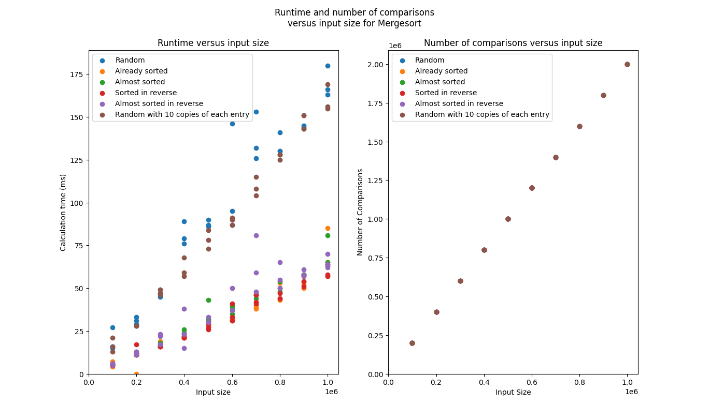

# An Analysis of Mergesort - Computation Time and Number of Comparisons
*Carter Hidalgo and Brian Smith*

## Brief
The goal of this report is to test the performance of Mergesort in terms of computation time and number of comparisons. We use a Java implementation, and timing is done internally using Java's built-in system time.

## Test Cases
We ran 6 different kinds of tests:
* Random
* Already sorted
* Almost sorted
* Sorted in reverse
* Almost sorted in reverse
* Random with 10 copies of each entry

with sizes ranging from 100,000 to 1,000,000 (incrementing by 100,000) and three instances of each combination of test kind and size. 

## Critical Code Analysis
### Method 0: `void sort(int[])`
```Java
void sort(int[] array) {
    comp = 0;
    comp++;
    if(array.length > 1) {
        int halfSize = array.length / 2;
        int[] leftArray = new int[halfSize];
        int[] rightArray = new int[array.length - halfSize];
        System.arraycopy(array, 0, leftArray, 0, halfSize);
        System.arraycopy(array, halfSize, rightArray, 0, array.length - halfSize);

        sort(leftArray);
        sort(rightArray);

        merge(array, 0, leftArray, rightArray);
    }
}
```
| Code                       |  Cost | Frequency |
| -------------------------- | ----- | - |
| `void sort(int[] array) {` | $0$   | 1 |
| `comp = 0;`                | $c_1$ | 1 |
| `comp++;`                  | $c_2$ | 1 |
| `if(array.length > 1) {`   | $c_3$ | 1 |
| `int halfSize = array.length / 2;` | $c_4$ | 1 |
| `int[] leftArray = new int[halfSize];` | $c_5$ | 1 |
| `int[] rightArray = new int[array.length - halfSize];` | $c_6$ | 1 |
| `System.arraycopy(array, 0, leftArray, 0, halfSize);` | $n$ | 1 | 
| `System.arraycopy(array, halfSize, rightArray, 0, array.length - halfSize);` | $n$ | 1 |
| `sort(leftArray);` | $T_s(n/2)$ | 1 |
| `sort(rightArray);` | $T_s(n/2)$ | 1|
| `merge(array, 0, leftArray, rightArray);` | $T_m(n)$ | 1 |
| `}` | 0 | 1 |
| `}` | 0 | 1 |

### Method 1: `void merge(int[], int, int[], int[])`
```Java
private void merge(int[] outputSequence, int dest, int[] leftSequence, int[] rightSequence) {
    int i = dest;
    int j = 0;
    int k = 0;

    while(i < leftSequence.length && j < rightSequence.length) {
        comp++;
        if(leftSequence[i] < rightSequence[j])
            outputSequence[k++] = leftSequence[i++];
        else
            outputSequence[k++] = rightSequence[j++];
    }
    
    while(i < leftSequence.length) {
        comp++;
        outputSequence[k++] = leftSequence[i++];
    }
    comp++;
    
    while(j < rightSequence.length) {
        comp++;
        outputSequence[k++] = rightSequence[j++];
    }
    comp++;
}
```
| Code                       |  Cost | Frequency |
| -------------------------- | ----- | - |
| `private void merge(int[] outputSequence, int dest, int[] leftSequence, int[] rightSequence) {` | $0$ | 1 |
| `int i = dest;` | $c_1$ | 1 |
| `int j = 0;` | $c_2$ | 1 |
| `int k = 0;` | $c_3$ | 1 |
| `while(i < leftSequence.length && j < rightSequence.length) {` | $c_4$ | $n$ |
| `comp++;` | $c_5$ | $n$ |
| `if(leftSequence[i] < rightSequence[j])` | $c_6$ | $n$ |
| `outputSequence[k++] = leftSequence[i++];` | $c_7$ | $n$ |
| `else` | $0$ | $n$ |
| `outputSequence[k++] = rightSequence[j++];` | $c_8$ | $n$ |
| `}` | $0$ | 1 |
| `while(i < leftSequence.length) {` | $c_9$ | $n$ |
| `comp++;` | $c_{10}$ | $n$ |
| `outputSequence[k++] = leftSequence[i++];` | $c_{11}$ | $n$ |
| `}` | $0$ | 1 |
| `comp++;` | $c_{12}$ | 1 |
| `while(j < rightSequence.length) {` | $c_{13}$ | $n$ |
| `comp++;` | $c_{14}$ | $n$ |
| `outputSequence[k++] = rightSequence[j++];` | $c_{15}$ | $n$ |
| `}` | $0$ | 1 | 
| `comp++;` | $c_{16}$ | 1 |
| `}` | $0$ | 1 |

Adding all these up gives us $c_{17} n + c_{18}$. Therefore, $T_m(n) = O(n)$

### Total

Define,
$$2^i=n$$
$$i=log_2(n)$$
$$i=lg(n)$$

Then, we can find the time complexity of Mergesort.

$$T(1) = 1$$
$$T(n) = c + 2T_{MS}(\frac{n}{2}) + n$$
$$=2T_{MS}(\frac{n}{2})+n$$
$$=2(2T_{MS}(\frac{n}{2^2}) + \frac{n}{2})+n$$
$$=2^2T_{MS}(\frac{n}{2^2})+2n$$
$$=2^2(2T_{MS}(\frac{n}{2^3}+\frac{n}{2^2})+2n$$
$$=2^iT_{MS}(\frac{n}{2^i})+in$$
$$=2^{lg(n)}T_{MS}(\frac{n}{lg(n)})+nlg(n)$$
$$=n1*T_{MS}(1)+nlg(n)$$
$$=nlg(n)$$
$$\Theta(nlg(n))$$

## Impirical Analysis


The number of comparisons increased linearly with the size of input (independent of the organization), but the performance depended on how organized the input was. Inputs that were already Sorted or Sorted in Reverse resulted in the lowest times with Almost Sorted and Almost Sorted in Reverse were very close in many cases, and both random cases performed much worse. 

## Conclusion
One interesting outcome from this analysis of the merge sort is that the initial state of the data had an impact on the performance of the sort. This is interesting because the merge sort always breaks down the problem into an equal number of sub-problems, as seen by the constant number of comparisons for each iteration of a given input size. It could be that the merge sort works best with large input sizes, and as we "zoom out" on the graph by increasing the input size the difference between the sorted variations and the random variations decreases. After all, the benefits of log-based algorithms are best seen with large input times. Alternatively, it may be that there is some optimization going on which is hidden from us that allows working with sorted lists or near sorted lists to run faster on my particular machine. Either way, we should keep in mind that the difference in sorting time was minimal - only a handful of milliseconds between input sizes of up to 1,000,000. The best conclusion to take from this analysis is that the merge sort is consistant in terms of cost while still providing a very fast sort, particularly for large input sizes. 

## Appendix: Raw Data

### Case 0: Random
| Input Size | Processing Time (ms) | Number of Comparisons |
| ---------- | -------------------- | --------------------- |
| 100000 | 15 | 200040
| 100000 | 27 | 200040
| 100000 | 16 | 200040
| 200000 | 29 | 400042
| 200000 | 31 | 400042
| 200000 | 33 | 400042
| 300000 | 47 | 600044
| 300000 | 45 | 600044
| 300000 | 49 | 600044
| 400000 | 79 | 800044
| 400000 | 76 | 800044
| 400000 | 89 | 800044
| 500000 | 87 | 1000045
| 500000 | 90 | 1000045
| 500000 | 86 | 1000045
| 600000 | 146 | 1200046
| 600000 | 95 | 1200046
| 600000 | 87 | 1200046
| 700000 | 153 | 1400046
| 700000 | 126 | 1400046
| 700000 | 132 | 1400046
| 800000 | 141 | 1600046
| 800000 | 130 | 1600046
| 800000 | 130 | 1600046
| 900000 | 145 | 1800044
| 900000 | 143 | 1800044
| 900000 | 144 | 1800044
| 1000000 | 163 | 2000047
| 1000000 | 180 | 2000047
| 1000000 | 166 | 2000047

### Case 1: Already sorted
| Input Size | Processing Time (ms) | Number of Comparisons |
| ---------- | -------------------- | --------------------- |
| 100000 | 7 | 200040
| 100000 | 5 | 200040
| 100000 | 4 | 200040
| 200000 | 11 | 400042
| 200000 | 0 | 400042
| 200000 | 11 | 400042
| 300000 | 16 | 600044
| 300000 | 16 | 600044
| 300000 | 19 | 600044
| 400000 | 21 | 800044
| 400000 | 21 | 800044
| 400000 | 22 | 800044
| 500000 | 29 | 1000045
| 500000 | 30 | 1000045
| 500000 | 29 | 1000045
| 600000 | 32 | 1200046
| 600000 | 32 | 1200046
| 600000 | 31 | 1200046
| 700000 | 40 | 1400046
| 700000 | 38 | 1400046
| 700000 | 39 | 1400046
| 800000 | 50 | 1600046
| 800000 | 53 | 1600046
| 800000 | 43 | 1600046
| 900000 | 57 | 1800044
| 900000 | 52 | 1800044
| 900000 | 50 | 1800044
| 1000000 | 85 | 2000047
| 1000000 | 65 | 2000047
| 1000000 | 57 | 2000047

### Case 2: Almost sorted
| Input Size | Processing Time (ms) | Number of Comparisons |
| ---------- | -------------------- | --------------------- |
| 100000 | 5 | 200040
| 100000 | 5 | 200040
| 100000 | 6 | 200040
| 200000 | 11 | 400042
| 200000 | 11 | 400042
| 200000 | 13 | 400042
| 300000 | 17 | 600044
| 300000 | 18 | 600044
| 300000 | 17 | 600044
| 400000 | 23 | 800044
| 400000 | 24 | 800044
| 400000 | 26 | 800044
| 500000 | 31 | 1000045
| 500000 | 32 | 1000045
| 500000 | 43 | 1000045
| 600000 | 39 | 1200046
| 600000 | 35 | 1200046
| 600000 | 40 | 1200046
| 700000 | 46 | 1400046
| 700000 | 44 | 1400046
| 700000 | 46 | 1400046
| 800000 | 50 | 1600046
| 800000 | 54 | 1600046
| 800000 | 48 | 1600046
| 900000 | 58 | 1800044
| 900000 | 58 | 1800044
| 900000 | 58 | 1800044
| 1000000 | 81 | 2000047
| 1000000 | 63 | 2000047
| 1000000 | 65 | 2000047

### Case 3: Sorted in reverse
| Input Size | Processing Time (ms) | Number of Comparisons |
| ---------- | -------------------- | --------------------- |
| 100000 | 5 | 200040
| 100000 | 5 | 200040
| 100000 | 5 | 200040
| 200000 | 17 | 400042
| 200000 | 12 | 400042
| 200000 | 11 | 400042
| 300000 | 16 | 600044
| 300000 | 16 | 600044
| 300000 | 16 | 600044
| 400000 | 22 | 800044
| 400000 | 21 | 800044
| 400000 | 21 | 800044
| 500000 | 27 | 1000045
| 500000 | 26 | 1000045
| 500000 | 29 | 1000045
| 600000 | 41 | 1200046
| 600000 | 33 | 1200046
| 600000 | 31 | 1200046
| 700000 | 41 | 1400046
| 700000 | 46 | 1400046
| 700000 | 42 | 1400046
| 800000 | 44 | 1600046
| 800000 | 47 | 1600046
| 800000 | 44 | 1600046
| 900000 | 54 | 1800044
| 900000 | 51 | 1800044
| 900000 | 54 | 1800044
| 1000000 | 64 | 2000047
| 1000000 | 58 | 2000047
| 1000000 | 57 | 2000047

### Case 4: Almost sorted in reverse
| Input Size | Processing Time (ms) | Number of Comparisons |
| ---------- | -------------------- | --------------------- |
| 100000 | 5 | 200040
| 100000 | 6 | 200040
| 100000 | 6 | 200040
| 200000 | 12 | 400042
| 200000 | 11 | 400042
| 200000 | 13 | 400042
| 300000 | 17 | 600044
| 300000 | 22 | 600044
| 300000 | 23 | 600044
| 400000 | 23 | 800044
| 400000 | 15 | 800044
| 400000 | 38 | 800044
| 500000 | 33 | 1000045
| 500000 | 30 | 1000045
| 500000 | 30 | 1000045
| 600000 | 37 | 1200046
| 600000 | 37 | 1200046
| 600000 | 50 | 1200046
| 700000 | 59 | 1400046
| 700000 | 48 | 1400046
| 700000 | 81 | 1400046
| 800000 | 65 | 1600046
| 800000 | 50 | 1600046
| 800000 | 55 | 1600046
| 900000 | 57 | 1800044
| 900000 | 58 | 1800044
| 900000 | 61 | 1800044
| 1000000 | 62 | 2000047
| 1000000 | 64 | 2000047
| 1000000 | 70 | 2000047

### Case 5: Random with 10 copies of each entry
| Input Size | Processing Time (ms) | Number of Comparisons |
| ---------- | -------------------- | --------------------- |
| 100000 | 16 | 200040
| 100000 | 21 | 200040
| 100000 | 13 | 200040
| 200000 | 28 | 400042
| 200000 | 28 | 400042
| 200000 | 28 | 400042
| 300000 | 46 | 600044
| 300000 | 49 | 600044
| 300000 | 47 | 600044
| 400000 | 68 | 800044
| 400000 | 57 | 800044
| 400000 | 59 | 800044
| 500000 | 73 | 1000045
| 500000 | 78 | 1000045
| 500000 | 84 | 1000045
| 600000 | 87 | 1200046
| 600000 | 90 | 1200046
| 600000 | 91 | 1200046
| 700000 | 108 | 1400046
| 700000 | 115 | 1400046
| 700000 | 104 | 1400046
| 800000 | 125 | 1600046
| 800000 | 128 | 1600046
| 800000 | 128 | 1600046
| 900000 | 151 | 1800044
| 900000 | 151 | 1800044
| 900000 | 143 | 1800044
| 1000000 | 169 | 2000047
| 1000000 | 155 | 2000047
| 1000000 | 156 | 2000047

