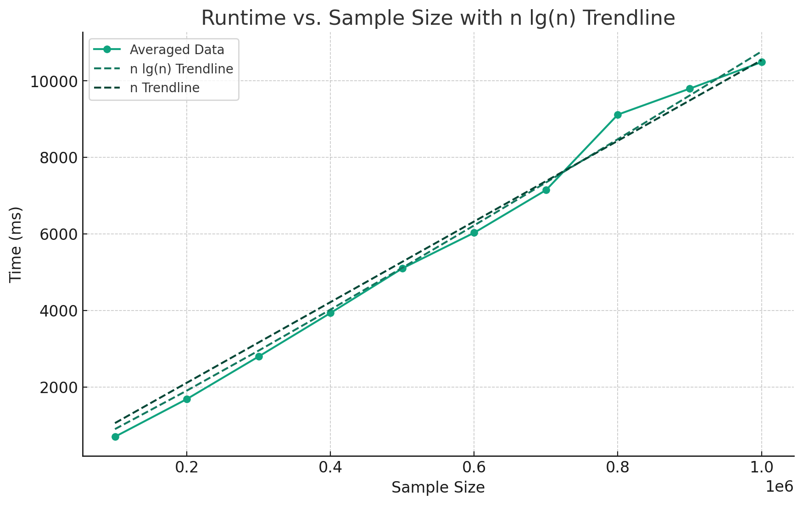

# Promotion Problem Algorithm Analysis Report
## Analytical Analysis
Here is the abridged form of the recursive algorithm in Rust.
```Rust
fn _closest_pair_r<X, T>(x: &[&T], y: &[&T]) -> (&T, &T, X) {
    if x.len() <= 3 {
        return _closest_pair_brute_force(x);
    }

    // Divide x into xl and xr based on l_x
    // O(1)
    
    // Divide y into yl and yr based on l_x
    // O(n)
    let mut yl: Vec<&T> = Vec::new();
    let mut yr: Vec<&T> = Vec::new();
    for point in y {
        if point.get_x() <= l_x {
            yl.push(point);
        } else {
            yr.push(point);
        }
    }

    // Conquer
    // 2 * T(n/2)
    let l = _closest_pair_r(xl, &yl);
    let r = _closest_pair_r(xr, &yr);

    let mut min = if l.2 < r.2 { l } else { r };

    // O(n)
    for i in 0..y.len() {
        // Find the minimum distance between y[i] and each in y[i+1..i+10]
    }

    min
}
```

Dividing `x` into `xl` and `xr` is constant time. We can simply split the slice in two, since `x` is already sorted. (`x` is sorted by x values and `y` is sorted by y values before the call to the recursive function is made.) Dividing `y` into `yl` and `yr` is linear time because we have to iterate through all values in `y`. The Conquer step is clearly $2 * T(n/2)$. Then, combining the two results requires us to at least iterate thorugh all values in `y`, so it is linear time. The total time formula is therefore,
$$T(n) = 2 T(n/2) + O(n)$$
which is case 2 of the Master Theorem, making the time complexity,
$$T(n) = \Theta(n*lg(n))$$

## Emperical Analysis
In experiments of test cases, it is unclear whether the time complexity is $\Theta(n)$ or $\Theta(n*lg(n))$. The tests consisted of sample sizes ranging from 100,000 to 1,000,000 in increments of 100,000. 
